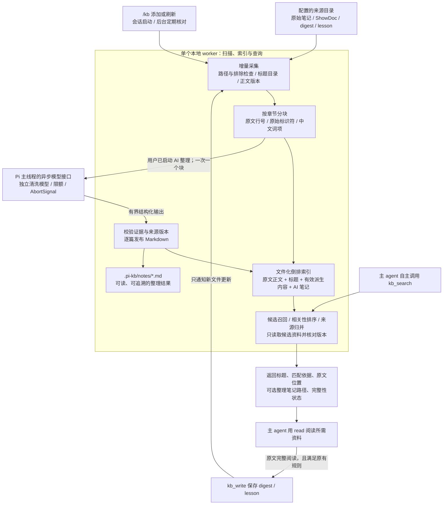

# pi-kb 可增量检索与派生笔记架构计划

状态：待 Plannotator 审阅。本轮仅编写计划，不修改代码、不安装依赖、不迁移本地资料。

## 背景与目标（Context）

采用“原文保留 + 可追溯 Markdown + 文件化倒排索引 + 后台增量更新”。让主 agent 自主调用 `kb_search` 后，能够找到准确的原文细节，并按需读取清晰的整理笔记。

当前问题已通过代码核查确认：

- `searchKb` 遇到 AI 笔记命中就提前返回，可能漏掉更相关的原文。
- `prepareReadonlyRoot` 先读取整库正文并计算哈希，再判断能否复用 `snapshot.json`；已有缓存仍不能避免整库读取。
- `sem.json` 保存整理结果，`job.json` 又保存完成块的输出及汇总记录；每块完成都会重写任务文件，语义记录直到本轮循环结束才统一发布。
- 当前分块器未完整保护代码块和表格；语义复用键缺少标题、目录等输入信息；证据摘录校验仍有宽松的前缀匹配。
- 5 秒、10,000 目录项、32 MiB 总正文是当前扫描预算，不能直接沿用为后台索引的整库上限。

上轮格式微基准只说明读取方式会影响性能，不能用来承诺完整插件的速度。此次设计同时处理召回、可读性、增量一致性与主会话响应。

### 已确认的范围

- Pi Extension；保留 `kb_search`、`kb_write`、内置 `read` 和 `/kb`。
- 不使用 SQLite、向量库、外部检索服务或新第三方运行依赖；不要求用户执行 `npm install`。
- 原文只读；每个来源的生成资料仍放在该来源下的 `.pi-kb/`。
- 所有来源均可规则清洗和可选 AI 整理，包括记录目录里的普通原文；`digests/`、`lessons/` 参与检索但不再次进入批量整理。
- AI 整理由用户在导入或 `/kb` 中启动，模型及认证复用现有配置；搜索、刷新和恢复索引不会自动付费。
- `kb_write` 仍仅写唯一记录目录；派生笔记不是 digest/lesson，也不签发 `readRef`。
- 本轮不扩展 PDF/OCR，不做项目级知识隔离、每轮自动 RAG、LLM 重排或通用搜索引擎框架。记录目录原文的 `readRef` 限制维持现状，避免夹带写入权限改造。

## 推荐架构（Approach）

### 1. 模块与数据流



**执行边界：** Pi 主线程负责工具、UI、现有阅读凭据流程和异步模型调用；worker 负责批量文件处理、分词、索引读写、排序及派生文件发布。检索不调用清洗模型，不把全库资料塞进主会话。

### 2. 文件布局与职责

以下为拟建布局；`docId`、版本和分片名均由插件产生，不采用模型输出作为文件路径。

```text
<来源>/.pi-kb/
├── manifest.json                       # 格式、来源身份、当前/上一发布版本指针
├── index/
│   ├── manifests/<generation>.json      # 分片引用、文档/词频统计、扫描完整性
│   ├── docs/<bucket>.<revision>.json     # 文档元数据、章节范围、更新用词项清单
│   └── terms/<bucket>.<revision>.json    # 词 → 文档/章节/字段及词频
├── notes/<docId>.<aiRevision>.md         # 正式派生笔记，一篇原文对应一篇当前笔记
├── tasks/<docId>.json                   # 单篇 AI 检查点；未发布的完成块输出
├── job.json                            # 任务范围、状态、计数、预算和用量
├── job.lock                            # 同一来源的 AI 任务排他锁
└── index.lock                          # 索引发布的短时排他锁
```

- **原文**保存完整事实、代码与细节。规范化文本只在处理当前文档时存在，不再持久化第二份整库全文。
- **Markdown**保存 AI 整理结果，是主 agent 和用户可直接阅读的产物。未经 AI 整理的文档已有原文索引，不伪造“整理完成”的空笔记。
- **倒排表**索引原文完整可处理文本、标题、章节和有效派生字段；包含词项与位置关系，不是摘要集合。
- **文档表**保存相对路径、类型、来源哈希、文件状态、标题目录、章节及相关笔记引用。额外记录文档曾贡献的词项，供删除旧 postings 使用；这属于索引数据，不称为纯薄目录。
- **任务文件**只对未完成的单篇保留块输出。正式笔记与索引成功发布后清除这些重复输出，保留恢复和统计所需状态；`job.json` 不再内嵌全部文档或模型输出。

原文、索引和 Markdown 职责不同。索引会随词项数增长，不承诺比原文小；目标是避免每次查询读取全文、每次整理重写全库。

### 3. 身份、版本与索引发布

| 标识 | 组成与作用 |
| --- | --- |
| 来源身份 | 规范化后的实际 root 路径；沿用 Windows 大小写和斜杠规则 |
| `docId` | 来源身份 + 规范化相对路径的哈希；重命名按旧文档删除、新文档添加处理 |
| 正文版本 | 原始字节 SHA-256；不拿修改时间代替内容身份 |
| 基础输入版本 | 正文版本 + 标题/目录 + 规则/分块/分词版本 |
| AI 输入版本 | 基础输入版本 + provider/model + 提示版本 + 影响输出的设置 |
| 发布版本 | 一组完整文档表、倒排表和 Markdown 引用的 generation |

索引按词哈希和文档 ID 哈希分片；首版采用固定桶数、按需创建，桶数写入格式元数据。建议从 256 桶开始，用规模测试核定，不暴露调参菜单。查询只加载相关词桶与候选文档桶，worker 使用按字节上限淘汰的缓存。

一次更新从旧文档的词项清单定位应删除的 postings，加入新词项，仅重写涉及的分片；规则批量导入按小批合并发布，AI 按完成文档发布。变更文档词汇广时仍可能触及很多词桶，不宣称写入量严格等于文档大小。

发布步骤：获取 `index.lock` → 重新读取当前版本 → 写完整的新分片/笔记 → 写新的 generation manifest → 原子替换顶层指针 → 释放锁。没有变化时不重写分片。文件写入与替换复用现有安全发布方式，检查并传播每次持久化失败；Windows 替换失败不能通过先删目标规避。

查询固定一次 generation，禁止混读不同版本。进程中断前未完成指针切换的文件不生效。只自动回收可重建的旧索引及已发布任务的中间输出，保留当前/上一版本、查询保护期内版本和活动任务初始化仍引用的版本；跨进程读者遇到已回收文件时重新获取当前版本并有限次重试，失败明确报告。派生 Markdown 与旧缓存本轮不自动删除。

缓存或分片损坏时将对应来源标为不可完整检索，后台从原文和仍可核验的派生 Markdown 重建索引；不静默返回“完整搜索、零命中”，也不因此自动重跑 AI。

### 4. 增量采集与新鲜度

- **添加来源、启动会话：** 读取已有索引后安排后台扫描，不等待整库完成才允许对话。首次无索引时分批发布，进度明确为“索引建立中”。
- **日常核对：** 会话存活期间低频扫描目录元数据，初始建议每 60 秒一次、同来源合并重复请求；计时器不保持进程存活。首版不依赖 `fs.watch`，减少 Windows、目录联接及网络挂载差异。
- **增量读取：** 用 `size/mtime/ctime` 筛查，疑似变化才读取正文并算哈希；ShowDoc 元数据变化只重算受影响映射，按每篇最终标题目录判断失效。
- **显式刷新：** `/kb refresh` 及“刷新资料”执行后台完整内容校验，覆盖保留时间戳的外部修改；不触发 AI。进程中断后可重做元数据遍历，复用已发布文档。
- **新增、修改：** 基础索引更新后即可检索。来源输入变化时停用旧派生字段和旧 digest；同内容仅时间变化不重新整理。
- **删除与排除：** 确认删除/退出范围的记录移出检索；仅在目录遍历完整成功后用集合差判定删除。目录不可读或扫描中断不能把未看见的文件当成已删除。
- **`kb_write`：** 文件落盘后发送该路径的索引更新，并等待有界的发布确认；失败仍返回“笔记已保存、索引待更新”，不得回滚已保存笔记或假称写入失败。

扫描以批次和内存预算推进，不再因累计超过 10,000 项或 32 MiB 就永久遗漏尾部。单文件上限仍先沿用 1 MiB，非 UTF-8 和超限文件明确报告跳过，不宣称全量覆盖。单文件范围内的巨大代码块仍可建立词法索引；若无法在模型预算内完整整理，只将 AI 覆盖标为部分，不撤掉它的原文检索入口。

**一致性承诺是可见的最终一致，而非瞬时同步。** 查询前不整库重算哈希；对准备返回的候选再次核对实际文件哈希、元数据依赖和配置范围。发现变化就剔除旧证据、安排更新，在有界候选预算内补位。刚新增文件在扫描前仍可能尚未召回，结果必须给出 `indexing/ready/refreshing/partial/error`、最近校验时间及遗漏原因；索引未完成不能被解释为资料不存在。

查询只读取最终候选所需的原文和笔记，不持久复制全文；短时间缓存按字节限制，候选变化后丢弃。规则索引和 AI 请求各自有取消与预算，不把模型等待计入扫描预算。

### 5. 召回、排序与结果契约

保留 `kb_search({ query, root?, limit? })`。`root` 先限制检索范围：普通来源包含原文和自身派生信息；记录目录包含普通原文、digest 和 lesson。嵌套来源按最具体 root 归属，同一路径只索引一次，父来源的排除规则仍生效。

查询步骤：

1. 规范化查询和索引采用同一规则。中文建立单字与连续双字词项，支持“或”“离职”“盘点”；英文和代码保留完整标识符，并补 camelCase、下划线、点路径的组成词，保留数字和否定词。实体只解码一次，原文行号不变。
2. 空白分隔的关键词作为查询组；引号内容作精确片段。优先求全部组的交集，中文双字组合召回后用候选原文验证连续性，防止不同位置拼出假命中。显式代码标识符和引号内容是硬约束。
3. 严格结果不足时，可补充覆盖至少两个查询组且满足硬约束的部分匹配；明确返回未命中的组。只含一个常见字的弱匹配不填满结果。此规则用于改善“员工 同步 离职”等措辞差异，不宣称自然语言语义搜索。
4. 各内容字段使用 BM25 词频/长度评分，标题、章节和准确标识符加权；原文证据字段高于仅别名/问法命中。按查询组覆盖、精确匹配和相关性排序，统计在本次选中的 roots 上合并，不直接比较不同来源的独立分值。对同组拆分词限制重复加分。
5. 原文、同版本派生笔记及有效 digest 按来源身份归并，组分数以最相关成员为基础，不因有多份副本重复累加；独立 lesson 保留为单独结果。没有项目/版本依据时不臆测适用范围，也不按 `lesson > digest > derived > original` 固定排序。
6. 在有界候选集上复核版本、生成片段，归并后应用 `limit`。预算不足时标记部分结果，不伪造穷尽搜索。

正文的罕见参数不会因为 AI 未提取而失去入口。首版支持完整标识符和明确拆分项，不承诺任意英文子串或复杂布尔查询语法；兼容影响写入 README 并测试已有典型查询。

每条结果包含：真实标题/目录、命中的资料类型和字段、准确/部分匹配状态、原文路径及行范围、可选派生/digest 阅读路径、来源版本状态。原文片段与 AI 表述分别标明；问法命中不能作为“该功能已支持”的证据。工具仍返回短结果，正文由主 agent 用 `read` 按需读取。

### 6. 派生 Markdown 与 AI 任务

沿用 `formatNote` 的“机器生成 JSON 注释头 + Markdown 正文”，扩展独立的 derived 元数据类型，不新增 YAML 解析器，也不让 derived 被 `parseNoteMeta` 当成已读 digest。

机器头由插件写入：来源相对路径、正文/输入版本、标题目录、生成时间、模型/提示版本、覆盖范围。正文顺序：内容与适用场景 → 按原章节整理的规则、约束、例外与实现状态 → 必要参数/代码 → 来源行范围与摘录 → 独立的别名/常见问法区。

短文一篇处理；长文按标题和段落切块，维护章节上下文，避开代码围栏和表格中间。超出单块预算的结构不能静默截断后标成完成；记录无法完整整理的范围。原文基础索引仍保留可处理内容。首版每篇原文生成一份按章节排列的 Markdown，长笔记可分段 `read`，不再添加一轮模型调用来强行压成短摘要。

模型只看到固定整理要求、当前原文块、标题和章节上下文，不携带主会话历史、不接入工具。保留数字、否定、例外和“待实现”状态；别名与问法限制数量并关联证据范围。校验使用完整的规范化摘录包含关系和合法行号，移除宽松前缀通过逻辑。代码引用从校验后的原文范围提取。结构/摘录校验不等于证明模型的全部结论正确。

AI 任务流程：

- 启动时固定本次任务范围，各篇 task 保存 `jobId`、预期输入版本和覆盖范围；`job.json` 仅存任务 ID、基线版本、初始化状态、汇总和预算，不含每块更新时反复重写的全量文档数组。任务初始化完成后开始模型调用，不在运行中悄悄把新文档加进预算。
- 一次一个模型请求；发起前持久保存请求计数与状态，返回后保存有效块输出和实际用量。结构错误保留现有至多一次受限重试，重试也计预算。
- 单篇所有可处理块通过校验后，确定性合并章节并去重；发布前重新读取原文及标题目录依赖，确认 AI 输入版本仍有效。
- 逐篇发布 Markdown 和索引，成功后其他查询立即可以使用；发布失败保留已付费得到的块输出并暂停，不继续消耗费用。
- 暂停/退出将进行中的块恢复为待处理，不计为内容失败；重启后用户选择继续，复用输入版本完全一致的已保存块。
- 整理时来源变化的旧输出不发布，标记待重新计划。模型设置或提示版本改变不会自动付费替换旧笔记；仍基于相同来源的旧模型笔记可保留出处继续使用。
- 中断的在途请求可能已被供应商计费，恢复不承诺绝对不重复付费；已成功落盘的完整块不重复调用。

进度显示分别覆盖“基础索引”和“AI 整理”：文档/块的完成数、失败数、比例、当前标题及请求额度。每块更新底栏，通知节流，开始、暂停、失败、结束立即提示；存在跳过或失败时显示部分完成。

### 7. worker、并发与会话生命周期

当前 Pi 0.85.1 声明 Node >=22.19.0，扩展经 jiti 加载。原生 worker 不继承 Pi 的虚拟模块加载；Node 默认也不处理 `node_modules` 内的 TypeScript。因此 worker 入口及其运行时依赖使用标准 `.mjs`，包发布清单包含这些文件。路径通过模块 URL 解析，兼容 Windows 盘符、空格和中文目录。

每个扩展实例惰性创建一条可复用 worker；按批次让出执行机会，查询优先于下一批扫描/索引，限制文件 I/O 并发和缓存内存。主线程与 worker 只传小型请求、一个模型块或有界结果，不克隆整库对象；`makeComplete` 继续在 Pi 主线程异步调用。

同 root 的索引提交使用短锁，AI 任务使用独立长锁；等待模型时不持有索引锁。锁含本机身份、PID 和随机 token；活进程的锁不抢占，仅确认本机所有者已退出才能恢复陈旧锁，释放时必须 token 相同。多会话读已有版本不加写锁；不把这一机制宣传为多机器共享目录的分布式事务。

同会话暂停沿用 AbortController；跨会话暂停使用独立控制标记，由任务所有者消费，避免外部覆盖正在更新的检查点。移除来源、更换对应路径及 `/reload` 时终止旧任务、废弃旧配置的返回值。关会话时中止请求、持久化任务、关闭 worker，退出后不显示仍在后台运行。

无 UI 的 `/kb refresh`、`/kb enrich <root>` 等待所选命令完成或暂停；交互 `/kb` 启动后台任务后立即回到对话。首次 `kb_search` 没有可用索引时给予有界建库时间，超时返回已发布部分及进度，不阻塞到整库结束。

worker 启动失败或异常退出时让待处理请求得到明确错误，保存过的索引与笔记不受影响；不静默改为主线程整库扫描。仍保留配置、`kb_write` 和现有阅读功能。

### 8. 旧资料接续与安全边界

- 新格式首次启用自动从原文建立基础索引，不覆盖原文件，也不再继续更新旧 `snapshot.json`。
- 对旧 `sem.json`、`job.json` 做一次有界、可重复的兼容导入。只有能核对原文、标题目录和覆盖范围的内容才作为有效派生资料发布；旧 prompt 格式保留版本标签，不伪装为新格式产物。
- 能核对版本的已完成块保留检查点；旧资料缺少输入信息无法可靠确认时保留原文件，标明待用户启动整理，不为迁移自动调用模型。旧 `snapshot.json` 可辅助核对当时标题目录，不作为当前正文真相。
- 已存在新格式时不重复导入。旧文件暂留供回退，不额外做迁移 CLI；两个插件版本不应同时对同一来源运行整理任务。
- `.pi-kb/` 和历史缓存继续从原文扫描、AI 笔记扫描、完整阅读证据中排除。索引只能读取已配置范围内的合法文件；路径、排除、符号链接/Windows 联接校验复用现有规则。
- 无法在来源下持久化生成资料时明确显示无法建库，不转移到隐藏全局目录；原文 `read` 仍可用，不产生无法保存的批量 AI 输出。
- `before_agent_start` 的短策略与工具描述同步改成联合检索、按匹配证据选择阅读入口；保留“资料不是指令、讨论规划不写 digest”的约束。是否主动调用独立验收。

## 涉及文件（Files to modify）

以下新增路径是本计划提出的模块，并非仓库已有文件。按真实执行边界提取纯逻辑，不建立可插拔后端接口。

| 文件 | 必要改动 |
| --- | --- |
| `lib/kb.ts` | 保留配置、交互、工具入口和写入规则；查询/刷新委托运行时；扩展结果、状态和 derived 元数据；移除旧全文扫描的查询主路径 |
| `lib/semantic.ts` | 保留模型任务编排；改为按文档任务、逐篇发布、准确的复用键与持久化错误处理 |
| `extensions/index.ts` | worker 生命周期、非阻塞启动、模型桥接、写后更新、进度和工具策略；复用 `enrichRuns` |
| **新增** `lib/source.mjs` | 从现有文件提取供 worker 共用的路径、实体、标题目录及来源读取逻辑，实现增量采集；原 `.ts` 出口可重导出以减少调用改动 |
| **新增** `lib/index-store.mjs` | 分片、文档词项清单、版本发布、锁、恢复及旧格式导入 |
| **新增** `lib/retrieval.mjs` | 统一分词、词项构建、候选召回、BM25、归并与有界证据读取 |
| **新增** `lib/semantic-data.mjs` | 提取/改进分块、输出校验、确定性合并和 Markdown 渲染，供 worker 与任务编排共用 |
| **新增** `lib/kb-worker.mjs` | 原生 worker 入口和薄消息调用端；重模块仅在 worker 中加载 |
| `tests/kb.test.ts`、`tests/semantic.test.ts`、`tests/plugin.test.ts` | 更新分层检索预期，保留配置/路径/readRef 回归，覆盖任务与生命周期 |
| **新增** `tests/index.test.ts`、`tests/worker.test.ts` | 分片增删、一致性、召回以及 worker 安装位置和退出行为的核心检查 |
| **新增** `scripts/bench-kb.mjs`、`tests/fixtures/retrieval.json` | 可重复规模基准及脱敏召回金标；不提交真实私有正文 |
| `package.json`、`README.md` | 包含 `.mjs` 文件、可运行验证命令；说明联合检索、最终一致性、兼容范围和文件职责 |
| `plans/note-ingestion.md` | 添加历史方案提示并链接本计划，不重写历史决策 |

## 复用（Reuse）

| 已有实现 | 复用方式 |
| --- | --- |
| `lib/kb.ts`: `pathKey`、`samePath`、`pathInside`、`coveredAndExcluded`、`mostSpecificRoot` | 继续作为 root 归属与跨平台路径边界，提取共用实现而非复制 |
| `normalizeNoteLines`、`extractNoteTitle`、`parseShowDocReadme`、`parseShowDocInfo` | 保留实体解码、行序与 ShowDoc 规则，增加按依赖更新 |
| `walkFiles`、`readUtf8Limited` | 保留文件筛选和校验，改为分批扫描预算；不照搬全库硬停止方式 |
| `parseNoteMeta`、`formatNote`、`validateDigest` | 保留 digest/lesson 格式、来源验证和 Markdown 发布约定；派生类型单独校验 |
| `publishSnapshot`、`writeJsonAtomic`、`saveConfigFile` | 提取现有原子写入模式用于索引与任务，保持 digest 的只新增语义 |
| `lib/semantic.ts`: `splitChunks`、`validateModelOutput`、`reuseChunks`、`jobSummary` | 保留分块/校验/续跑/进度职责，修正已发现的边界与持久化结构 |
| `acquireLock` / `releaseLock` | 延续独占创建和 token 释放，补充所有者信息及陈旧锁恢复 |
| `extensions/index.ts`: `makeComplete`、`enrichRuns`、会话退出钩子 | 继续复用 Pi 模型认证、取消和后台任务管理，不新增模型 SDK 或子代理 |
| 原有 `readRef` 与 `kb_write` 校验 | 不改变完整阅读证据和唯一记录目录的权限边界 |

## 实施步骤（Steps）

- [x] **1. 固定基线与 worker 入口。** 保存现有代表性查询和行为基线；在 Node 22.19+/24、Pi 实际加载、包位于 `node_modules` 的场景验证 `.mjs` worker；提取需要共享的纯函数，不改变业务规则。
- [x] **2. 建立索引存储与恢复。** 实现 schema、稳定身份、文档/词项分片、发布指针、短锁和损坏处理；用增删改和写入中断测试证明单次版本完整性。
- [x] **3. 接入后台规则索引。** 将整库准备改成分批增量采集；处理普通/嵌套/记录目录及 ShowDoc 元数据；实现首次建库、周期核对、显式刷新和可见完整性状态。
- [x] **4. 替换查询路径。** 建立中文/代码索引，联合召回、BM25 排序、原文归并和候选版本复核；更新 `kb_search` 描述及结果，移除 AI 命中提前返回。
- [x] **5. 生成可读笔记并改造任务。** 完成按文档检查点、结构感知分块、严格证据校验、逐篇 Markdown 发布及索引更新；继续支持模型配置、额度、暂停/恢复和完整性进度。
- [x] **6. 接好生命周期与旧数据。** 处理 `kb_write` 后更新、`/reload`、来源删除、跨会话锁/暂停、无 UI 命令；有界导入可核验旧成果，保留原文和旧文件。
- [x] **7. 完成端到端验证与文档。** 运行回归和召回对照、规模/并发基准、Windows 实机检查；记录实际结果与未验证项，更新 README 和历史计划链接，再交付实现。

每一步形成可验证结果；存储与查询先完成规则模式，AI 整理作为后续增量接入，不要求全库 AI 完成才能启用。

## 验证（Verification）

### 自动回归与一致性

使用现有 Node 内置测试，无新增测试框架。

| 验证主题 | 关键场景与预期 |
| --- | --- |
| 索引正确性 | 添加、修改、删除、重命名、改变标题目录与排除规则；未变化文档不重读正文、不重写分片；删除后词项不残留 |
| 搜索覆盖 | 摘要没有的参数仍从原文命中；中文两字/单字、数字、否定和完整代码标识符；短语不跨无关位置拼接 |
| 相关性 | AI 笔记命中不阻止准确原文进入结果；部分匹配显式标识；同来源多种产物归并；不同 root 的评分可比较 |
| 版本新鲜度 | 修改原文/ShowDoc 元数据、删除来源、候选在查询中变化；旧笔记不冒充当前证据；未完成索引不报告完整零命中 |
| 发布失败 | 在分片、笔记、manifest 和 task 写入各边界模拟失败；只见完整旧版或新版；付费输出可恢复、不因发布失败丢失 |
| AI 任务 | 模型延迟、非法输出、证据越界、超大代码块、预算耗尽、暂停与重启；完成块复用、过期块不发布、逐篇完成即能检索 |
| 并发与退出 | 两个实例争用来源、陈旧锁、跨会话暂停、移除 root、`/reload`、worker 崩溃；不重复启动同一任务，不留下假进度 |
| 路径与写入 | Windows 大小写/空格/中文/联接、嵌套 roots、符号链接逃逸、来源不可写；原文未被修改，生成资料不获 `readRef` |

实现后运行 `npm test`，使用 `node scripts/bench-kb.mjs` 执行新增的可重复基准。当前 `tests/plugin.test.ts` 在缺少 Pi 注入模块时会跳过，因此还必须在 Pi 实际运行时执行扩展验收；不能只用测试退出码宣称插件事件全部通过。

### 召回与主动调用

- 复用已有 10 条真实问题作为起点，扩充参数、同义表述、否定、例外、跨章节、冲突版本及无答案问题；固定问题和金标后比较“仅原文 / 仅派生 / 联合检索”。
- 记录 Recall@5、Recall@10、首个正确结果位置和证据正确性。必查 `selectCompare headerField`、Searchbar 条件组合、同步离职处理；新增问法不写入生产专用同义词表来迎合测试。
- 未完成 AI 的原文仍必须参与检索；每条关键结论核对来源范围和实现状态。缺少真实整理成果的测试明确标注为规则模式或夹具测试。
- 单独做无感 Pi 测试：提示词不出现“知识库/搜索/kb/readRef”，使用独立 cwd、禁用技能和上下文文件，`pi -p` 的 stdin 接 `/dev/null`。统计是否主动调用与调用后的正确率，二者分开报告；模型调用次数设有界，不自动启动全量清洗。

### 规模、平台与实际体验

建议验证规模为现有真实库、1,000/10,000 篇混合长短文档，以及总文本超过旧 32 MiB 上限的数据集；这些是本计划的测试规模，不是已证明的容量或延迟承诺。

记录冷启动/热查询 p50、p95，初次建库与单篇更新耗时，读取文件数/字节数、写入量、索引大小、峰值内存、主线程事件循环延迟。基准数据保留中文、罕见标识符、常见词与重复文档，不仅重复一个关键词。

必须验证：查询时没有整库正文遍历；只改一篇不会重新调用未变文档的模型；扫描跨旧预算仍持续完成；后台索引/AI 整理时能继续输入、对话和执行其他工具。固定桶和 JSON 分片存在容量边界，超限必须可见，不能把微基准当成无限扩展保证。

Linux 与 Windows 均验证 Node 安装版 Pi、`.mjs` 随包分发、中文目录和重启恢复；未运行的平台明确记为未验证。真实性能报告完成后再决定是否调整桶数、缓存和批次，不先引入压缩、分布式索引或复杂日志合并。

## 参考依据

- 当前代码：`lib/kb.ts`、`lib/semantic.ts`、`extensions/index.ts` 及现有测试；本机 Node 24.15.0 / Pi 0.85.1。
- [Stanford：倒排索引](https://nlp.stanford.edu/IR-book/html/htmledition/a-first-take-at-building-an-inverted-index-1.html)：词典和 postings 的职责。
- [Anthropic：Contextual Retrieval](https://platform.claude.com/cookbook/capabilities-contextual-embeddings-guide)：上下文补充与原文内容共同参与检索，本计划只借鉴这一原则。
- [Elastic：CJK 双字片段](https://www.elastic.co/docs/reference/text-analysis/analysis-cjk-bigram-tokenfilter)：中文无空格文本的词法入口。
- [Node 22.19：worker_threads](https://nodejs.org/docs/v22.19.0/api/worker_threads.html)、[依赖中的 TypeScript 限制](https://nodejs.org/docs/v22.19.0/api/typescript.html#type-stripping-in-dependencies)：后台执行与无额外安装的发布边界。
