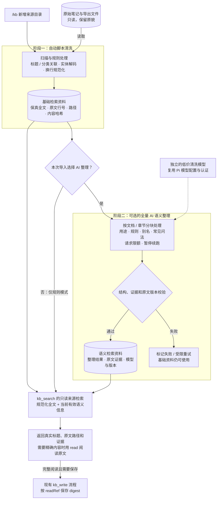

# 笔记目录接入与规则清洗方案

状态：历史方案。当前实现与后续架构见 `plans/kb-index-architecture.md`。本文保留当时的两阶段清洗决策，不作为施工说明。

## Context — 背景与目标

用户希望把 pi-kb 做成规范化插件，重点关注 AI 主动调用和召回准确性。本次直接提出的缺口是：新增笔记目录后，插件应自动清洗和整理用于检索的资料，而不能仅保存目录配置。

已确认的要求：

- 新增目录后自动执行规则清洗；每次导入由用户选择是否使用低价模型，对本次来源的全部可处理文档做语义整理。
- 清洗模型独立配置，复用 Pi 已配置的模型与认证；任务有用量上限、进度、暂停和断点续跑。
- 原文保持只读，生成独立资料，保留来源与版本关系。
- 当前先做方案，提交 Plannotator 审阅后再进入实施。

## 已知现状

- `lib/kb.ts:configureKbInteractive` 的“添加目录”目前只通过 `applyRootChange`、`saveConfigFile` 保存配置，没有接入处理流程。
- `searchKb` 每次遍历原目录；`matchFile` 临时解码 HTML 实体，要求所有关键词命中，不读取标题映射。
- AI 笔记一旦命中，默认查询便提前结束，不再搜索原文。
- `showdoc/` 有 80 篇正文，哈希文件名与真实标题的关系保存在 `prefix_readme.md`；另有 `prefix_info.json` 导出资料。目前 ShowDoc 尚未正式加入用户配置。
- 已做的诊断查询中，`Searchbar 或` 无命中，`搜索栏 或` 可命中正文；说明标题和正文未关联。

## Approach — 推荐方案

本轮范围为“目录清洗及检索接入”，按审阅反馈加入可选的低价模型全量语义整理。项目级笔记隔离、主会话 AI 主动查记策略、向量检索和整体排序改造仍不在本轮。

采用两阶段接入：

1. **规则阶段（自动）**：来源扫描、标题目录关联、文本规范化，完成后立即可搜索。
2. **语义阶段（本次导入可选）**：调用用户选定的低价模型，逐篇/逐段提取用途、关键规则、检索别名和常见问法，逐步增强检索。

两类生成资料都关联原文版本；AI 语义整理不覆盖原文，也不代替原文参与检索。

### 架构图：先脚本清洗，再可选 AI 整理

图中的顺序与职责：

1. **脚本先处理结构和格式。** 例如把 ShowDoc 的哈希文件关联到“搜索栏Searchbar”及“平台 / 功能清单”，保留逐行原文内容，不解释或改写业务规则。
2. **AI 使用脚本阶段的产物。** 在标题、分类、带原始行号的规范化文本上整理语义，例如提取“条件之间为 AND、不支持 OR、复杂条件组件待集成”，并补充有证据的检索表达。
3. **生成资料有两层。** 基础资料始终参与原文检索，语义资料校验后作为补充；二者保存到独立缓存，不回写原文。AI 整理失败或未启用，不影响已经就绪的基础搜索。
4. **检索与整理分别执行。** 添加/刷新资料时才选择付费整理，普通搜索不调用清洗模型；图中的检索仅表示只读来源层，现有默认 AI 笔记优先策略保持不变。

### 接入与刷新

- `/kb` 添加只读来源后，保存配置并自动完成规则阶段；显示文档数量及跳过项，再提供“仅规则清洗 / 使用 AI 全量语义整理”的选择。添加 AI 记录目录不触发来源清洗。
- 选择 AI 后，展示当前清洗模型与本次预计请求量；未配置模型时先选择并保存。此次选择即启动该来源的任务，不逐篇再次确认。
- 会话加载旧配置、手改配置后的首次使用，自动补建规则资料；仅显示可继续的 AI 任务，不自动产生新的模型费用。
- 搜索进入只读来源层前检查变化：更新规则资料，停用过期语义资料并标记待整理；搜索本身不发起付费整理。
- `/kb` 可刷新规则资料、启动/暂停/继续 AI 语义整理。后续变更只处理新增、变化或失败文档，已完成且版本相同的记录复用。
- 用户本次不选 AI，也可以正常搜索和沿用现有完整 `read` → `kb_write` 的按需 digest 流程。

### 清洗规则

| 输入 | 处理方式 |
| --- | --- |
| 现有支持的 UTF-8 文本格式 | 保留支持范围；统一 CRLF/CR 换行、处理文件开头 BOM、单次解码 HTML 实体；检索时沿用空白与大小写匹配规则 |
| 普通 Markdown/文本 | 标题优先取有效 Markdown 标题，避开代码块；没有标题则使用文件名；相对目录作为检索上下文 |
| ShowDoc 导出目录 | 识别同目录 `*_readme.md` 的“标题 → 文件”关系；标题与正文联合匹配，不改哈希文件名 |
| ShowDoc 的 `*_info.json` | 校验已识别的导出结构，从 `pages/catalogs` 补充分类；按唯一标题关联正文，重复或无法确定的关联只报告，不猜测 |
| 导出元数据文件 | 仅成功识别的标题目录和对应 JSON 不作为重复正文返回；解析失败时报告原因并退回普通文本处理 |
| 代码、HTML、公式、图片引用 | 保留原文本和逐行对应关系；不执行脚本、不全局剥标签、不推测图片内容、不改写数值或“待实现”等状态 |

标题优先级：有效 ShowDoc 标题映射 > 正文标题 > 文件名。清洗与搜索共用一次实体解码结果，避免 `&amp;lt;` 被两次解码。所有映射路径都必须属于当前来源、满足排除规则，且不能经符号链接逃出来源。

### 可选的 AI 全量语义整理

**模型接入。** 已核对本机 Pi 0.85.1：`ctx.modelRegistry` 提供 `getAvailable()`、`find(provider, modelId)` 和 `complete(model, context, options)`。扩展复用此接口和 Pi 的认证，不另存 API key、不绑定某个供应商，也不默认把主会话模型当作低价模型。首次配置从已可用模型中选择独立的清洗模型；显示已知价格，未知价格标为未知。启动时检测此能力，旧 Pi 缺失接口时明确提示 AI 整理不可用，规则清洗继续可用。

**配置。** 在 `pi-kb.json` 增加可选的清洗模型及任务限额配置；兼容只有 `roots` 的旧配置。扩展 `parseConfigJson` / `saveConfigFile` 时保留新字段。建议默认串行，每请求输出上限 2,048 tokens、超时 60 秒；任务请求上限默认为本次待处理块数的两倍（每块一次调用及至多一次重试），启动时展示并可调低。配置了模型不等于所有导入自动付费，仍按每次导入的选择执行。

**输入与输出。** 请求只包含固定整理要求、当前文档标题/分类和带原始行号的文本，不携带主会话历史，不提供工具执行能力。文档中的指令作为资料处理。要求有界的结构化结果：

- 内容概述与适用场景。
- 主题词、组件/API 名称及有依据的检索别名。
- 可复用规则、约束、关键数值和“已实现/待实现”等状态。
- 相关业务问法，例如“几个条件满足一个是否可以”。
- 每条规则和检索扩展对应的原文行范围、证据摘录。

原文中存在的代码、公式、数值与否定不能被语义整理改变。插件校验结果结构、字段长度、证据行范围和摘录能否在当前原文找到；这只是结构与证据定位校验，不宣称已经机器证明语义完全正确。

**全量覆盖。** 全量指遍历本次来源全部可处理正文，不承诺一份摘要穷尽每个细节。空文或没有可提取文字的页面标明原因，不推测图片内容。短文整篇输入；长文按章节/行范围分块，为模型上下文预留输出空间。所有块处理完成后才标记该文档语义就绪，保留各块的来源范围并确定性合并/去重，不静默截取前半篇冒充完整整理。超过来源扫描限制或不可读的文档单独列为未处理/跳过。

**质量与失败。** JSON 不合法、缺少证据或明显字段违规时允许一次受限重试；网络错误按任务重试限额处理，认证或模型不可用则暂停任务。仍失败的文档不发布语义记录，其他文档可以继续；原始检索资料保持可用。未知规则不补写，不用虚构内容填满字段。

### 独立生成资料

建议位置为 `<pi-kb.json 所在目录>/pi-kb-cache/`，按规范化来源路径哈希保存规则/语义快照和任务检查点；这是新增的插件生成数据目录，不进入用户的原文目录或 AI 记录目录。

- 每个来源保存结构化快照和独立任务检查点，包含来源身份、格式/规则版本、配置与导出元数据指纹；生成文件按当前用户私有数据创建，读取时验证格式和大小。
- 逐篇基础记录包含原文路径、标题、目录、内容哈希和保留原始行序的规范化文本；可选语义记录另外保存模型 ID、提示版本、输入指纹、覆盖行范围、整理结果与 token 用量。
- 语义记录复用键包含正文和标题目录指纹、模型 ID、提示版本及分块规则版本；规则刷新不重写未变化资料，未变化的已完成语义块不重复调用模型。
- 原文或元数据变化后，相应旧语义立即停止参与检索；模型/提示版本变化后的重新整理由用户在刷新时启动，原模型产出的记录仍保留明确出处。
- 先写同目录临时文件，再原子替换完整记录/检查点；沿用 `saveConfigFile` 的发布方式，不套用 digest 的“存在就不覆盖”语义。AI 返回时再次核对来源版本，过时结果不发布。
- 验证生成目录不落入只读来源，不跟随生成目录/文件的符号链接；若无法安全保存，明确报告并使用当次内存结果降级。
- 缓存路径始终排除在来源扫描、AI 笔记检索和 readRef 签发之外；生成资料不是 digest/lesson，也不是模型完整阅读证据。
- 不配置可写 root 时仍能建立检索资料；`kb_write` 仍按原规则要求记录目录。

### 生命周期、任务与费用

| 事件 | 行为 |
| --- | --- |
| `/kb` 添加只读目录 | 自动完成规则阶段；用户本次选 AI 才建立全量语义任务。界面区分“规则已就绪”和“语义整理进度” |
| 新会话或 `/reload` | 补建/校验规则资料；列出未完成任务，可由用户继续，不自动启动付费任务 |
| 手改配置、搜索指定来源 | 读取最新配置并准备规则资料；过期语义停用；不把扫描或模型调用塞进 `loadConfigFile` |
| `/kb` 刷新资料 | 刷新规则；可选择对该来源执行 AI 增量整理或继续未完成任务 |
| 原文新增/修改/删除 | 下次准备时更新/移除基础记录，变化记录的语义标记待整理；删除结果立即退出搜索，相关待执行任务取消 |
| 删除来源/设为记录目录 | 停用来源生成资料并停止其 AI 任务；不删除原文、AI 笔记或已经保存的生成文件 |
| 暂停、退出、超时 | 中止本任务正在进行的请求，保存检查点；已完成块不重复调用，恢复时重新核对原文与限额 |
| 缓存损坏或版本变更 | 规则资料可自动重建；需重新调用模型的部分标记待整理，不能自动重跑整库产生费用 |
| 认证失败、预算耗尽 | 暂停该任务并给出原因；修复配置/调整限额后可继续 |
| 磁盘写入失败 | 规则结果可在内存使用；AI 任务暂停，未能安全保存检查点时不继续发起付费请求 |

**执行方式。** 任务运行在当前 Pi 进程内，默认串行，复用所选模型服务，不新增外部任务服务或子代理。UI/RPC 长会话中异步运行并提供进度；短命的非交互调用等待命令任务结束或达到限额，避免进程提前退出。无 UI 可用 `/kb refresh` 做规则刷新、`/kb enrich <root>` 启动/继续语义整理、`/kb pause <root>` 暂停。检查点持久化，进程结束后不会假装后台仍在运行。

**任务状态。** 每篇/块记录 pending、running、completed、failed 或 stale；来源汇总完成数、剩余数、失败/跳过原因、请求数和 token 用量。只有所有可处理块成功且未出现扫描截断时，才报告全量语义整理完成；否则明确标记部分完成。

**费用控制。** 规则阶段报告文档数量、内容规模和预计分块数。选择 AI 时展示清洗模型、输出上限与任务请求上限；按模型价格元数据提供费用估算，价格未知时不展示“免费”。每次调用前计入请求限额，重试也计数；每次返回后累计实际 token 用量及可获得的费用。达到上限便暂停，可调高后继续。超时/异常请求若没有用量回执，标记费用未知，不记作零。不能把估算金额当成供应商账单的硬上限。

**扫描与调用分开限时。** 规则扫描沿用约 5 秒、10,000 目录项、32 MiB 内容和单文件 1 MiB 的现有预算，并限制生成快照读取大小；AI 阶段使用独立的请求超时、上下文/输出限制和任务限额。规则扫描中断不覆盖完整快照，未检查的旧资料不作为本次有效结果；也不将未扫描文档算作 AI 全量完成。

**并发与恢复。** 同一进程合并同一来源的规则准备；同一来源仅允许一个 AI 任务执行，采用本地排他锁避免两个 Pi 会话重复付费。跨进程原子写入检查点，旧任务已结束后才能恢复锁；已经完成并落盘的块复用，无法确认完成的在途调用保留未完成状态。任务恢复前再次验证配置、来源哈希、模型和提示版本。

### 搜索接入

- 只读来源检索联合匹配标题、分类、规范化全文，以及当前版本有效的语义主题词/别名/常见问法；AI 未完成或失败时仍可检索基础资料。
- 同一原文只返回一个候选，不把规则文本与语义摘要各算一次命中。
- 结果显示真实标题、原文路径和对应行号；仅在 AI 补充字段命中时明确标为“语义索引匹配”，展示关联的原文证据，不把模型生成的句子伪装成原文片段。
- `root` 参数、默认 AI 笔记优先行为和多关键词全部命中的规则本轮保持不变。语义别名扩充可匹配文本，但不保证所有自然语言问法都能命中。
- 内置 `read` 仍读取原文；批处理生成资料不能签发 readRef，也不会绕过现有 `kb_write` 对完整阅读的要求。

## Files to modify — 涉及文件

- `lib/kb.ts`：清洗模型/限额配置的读写兼容，规则清洗、生成资料保存、来源变更、标题与语义字段检索、状态展示。
- `lib/semantic.ts`（新增）：语义任务分块、结果校验、限额、暂停恢复与状态管理；接收模型调用函数，保持可用假模型独立测试，不依赖 Pi 运行时。
- `extensions/index.ts`：Pi 模型选择与 `modelRegistry.complete` 适配，导入时选择、任务生命周期、UI/RPC/非 UI 命令及 readRef 边界。
- `tests/kb.test.ts`：普通/ShowDoc 清洗样例、缓存与检索、配置兼容和文件边界。
- `tests/semantic.test.ts`（新增）：模拟模型的覆盖、失败、费用限额、恢复和来源变更测试。
- `tests/plugin.test.ts`：导入选项、模型注册表适配、无 UI 命令、会话退出与生成资料隔离。
- `README.md`：两阶段导入、模型与费用设置、任务控制、来源更新及生成数据说明。

不新增运行时依赖；不改用户的 `showdoc/`、Obsidian 原文或既有 AI 笔记。规划期间只修改本方案文件。

## Reuse — 复用点

| 现有实现 | 本轮用途 |
| --- | --- |
| `lib/kb.ts:loadConfigFile / applyRootChange / saveConfigFile` | 保留配置格式与纯配置读取；复用配置校验和原子发布模式 |
| `lib/kb.ts:configureKbInteractive / formatStatus` | 添加目录后触发处理，新增刷新入口与处理结果展示 |
| `lib/kb.ts:pathKey / samePath / pathInside / coveredAndExcluded` | 来源身份、Windows 路径、排除项和越界判断 |
| `lib/kb.ts:walkFiles / readUtf8Limited / newBudget` | 复用扫描上限、UTF-8 判定、符号链接跳过和取消信号 |
| `lib/kb.ts:decodeEntities / asLines / sourceTitleFrom / sha256` | 统一清洗、标题回退和版本检查，避免重复实现解码 |
| `lib/kb.ts:matchFile / searchLayer / formatSearch` | 把标题和分类纳入匹配，保留原文路径、行号与结果状态 |
| `extensions/index.ts:read 事件` 与 `lib/kb.ts:writeDigest / validateDigest` | 保留主会话按需 digest 的完整原文阅读要求和来源校验 |
| Pi 0.85.1 `ctx.modelRegistry.getAvailable / find / complete` | 复用模型配置、认证及调用，不另接一套供应商 HTTP 客户端 |

规则准备入口由交互添加、会话加载、显式刷新和原文检索共同调用；AI 任务单独由用户本次导入选择或显式整理命令启动。

## Steps — 实施步骤

- [x] 实现规则清洗和生成资料格式：复用扫描、标题/目录映射、逐行规范化，兼容旧配置与无记录目录。
- [x] 实现来源变化、缓存发布与失效处理，确保检索不会使用删除/变更原文的旧资料。
- [x] 增加独立清洗模型及任务限额设置，对接 Pi 模型注册表；导入时可选 AI，规则模式不调用模型。
- [x] 实现语义分块、结构化输出与证据校验，保存模型/提示/输入版本；单篇完成后发布，源变化时拒绝过时结果。
- [x] 实现串行任务、用量统计、限额、暂停、恢复及跨会话排他控制，接通 UI 和命令。
- [x] 将有效语义字段并入同一原文候选，明确区分 AI 匹配依据与原文片段，保留 readRef 边界。
- [x] 用模拟模型完成确定性测试，再用用户配置的实际低价模型做小批量质量验证及 ShowDoc 全量验收，更新 README。

## Verification — 验收

### 自动测试

| 场景 | 必须验证的结果 |
| --- | --- |
| 普通目录接入 | 添加后生成独立快照；只有只读 root 也能工作；源文件及目录清单不变 |
| ShowDoc 标题/目录 | 哈希文件关联正确标题；`Searchbar 或` 命中组件正文，标题为“搜索栏Searchbar”，分类为“平台 / 功能清单”，返回原文第一行规则 |
| ShowDoc 异常输入 | 重复标题不误归类；映射越界/符号链接被拒绝；普通 JSON/README 不因名称相似而被误排除 |
| 内容保真 | CRLF、BOM、实体编码、代码块、`<script>`、公式、否定和“待集成”状态保持正确；片段行号能在原文核对；实体只解码一次 |
| 刷新生命周期 | 未变化目录不重写快照；正文、标题映射和排除项变化后规则资料刷新，旧语义停用且搜索不自动调用模型 |
| 模式与模型配置 | 选择仅规则时模型调用数为零；选择 AI 时使用单独指定模型；修改 roots 不丢失清洗配置，旧配置仍可加载 |
| 语义覆盖与质量校验 | 长文所有块均被送入模拟模型；引用越界/摘录不符/非法 JSON 不发布；全部块通过才标记该文档完成 |
| 语义召回 | AI 别名参与同一原文匹配；结果标明语义依据和原文证据，不把生成文本伪装成原文行 |
| 费用与恢复 | 重试计入请求限额；达到限额暂停；恢复不重复调用已完成块；网络失败的未知费用不能记作零 |
| 失败/中断 | 缓存损坏能重建规则；持久化失败暂停 AI；扫描截断不冒充全量完成；来源在请求期间变化时丢弃旧结果 |
| 边界与并发 | 排除项、AI 目录、缓存、Windows 路径正确；两会话不能对同一来源同时运行 AI 任务；检查点原子发布 |
| 阅读与写入 | 读缓存不签发 readRef；完整读原文仍可写 digest；部分/截断阅读不签发；旧 digest/lesson 行为继续通过 |

运行 `npm test`。核心测试无需新增依赖；扩展套件若因缺少 Pi 注入模块被跳过，应单独注明，继续完成下列真实 Pi 验收，不把跳过当通过。

### 真实 Pi 验收（实施后执行）

1. 使用独立测试配置添加目录，先选择“仅规则清洗”：确认无模型调用、生成资料可用，`Searchbar 或` 能直接返回组件正文。
2. 配置用户选择的实际低价模型，先整理 Searchbar、离职处理和无效问卷等小样本，核对否定、数值、条件及原文证据。特别检查“仅 AND、不支持 OR、高级搜索待集成”“实体用户与虚拟表处理不同”“小于 88 秒、趋同率超过 90%”没有被改写成错误规则。
3. 在真实导入选择 AI，对 ShowDoc 80 篇正文执行全量任务；记录模型 ID、完成/失败/跳过数、分块覆盖、token 用量及可获得的费用，核对所有原文内容哈希和文件清单不变。
4. 将当前 14 条诊断查询作为固定对照集，分别比较仅规则与规则＋语义的预期正文 Top-8 命中情况，重点检查 `员工 同步 离职`、`问卷 乱填` 等表达；同时记录误召回和无来源支撑的扩展，不仅报告命中数。不预先宣称准确率提升百分比。
5. 暂停任务并重开 Pi 后继续；确认已完成块不重复付费。用小请求限额、错误模型配置模拟暂停与恢复，确认基础搜索持续可用。
6. 修改/删除临时原文、修改标题映射，验证旧语义立即失效，显式再次整理才调用模型；完成原文 `read` → readRef → digest 的兼容回归。

本轮完成标准：目录接入自动生成可追溯的基础检索资料；用户可选择低价模型全量语义整理，并看见进度、用量和真实完成范围；生成的语义信息可用于召回、可定位原文且可增量刷新；原文不被修改。主会话主动调用率、向量检索及默认 AI 笔记提前返回问题仍不作为本轮改造范围。

## 决策记录

- 首轮审阅反馈已纳入：数据接入支持低价 AI 全量语义整理。
- 第二轮审阅反馈已纳入：补充架构图，明确执行顺序是脚本规则清洗 → 本次导入可选的 AI 语义整理。
- 用户已确认：**每次导入时可选**，不设为所有目录默认自动付费处理。
- 已确认：保留原文，生成独立资料；规则清洗自动进行。
- 本轮范围为目录清洗及检索接入，AI 语义整理属于接入流程；项目级笔记隔离与主会话主动调用策略仍不在本轮。

## 新发现与实现约束

- `configureKbInteractive` 与无 UI 的 `/kb` 目前走不同分支，必须接入同一个处理入口，避免仅交互添加生效。
- `loadConfigFile` 被写入、检索、配置等多处调用，应继续只负责解析配置，避免每次读取配置都触发全库处理。
- 现有测试明确要求实体解码后仍保留 `<script>` 示例和原始行号；清洗不能粗暴剥除 HTML 标签。
- 现有测试允许零个可写目录，因此生成资料不能强制依赖 `config.writable`。
- 默认 AI 笔记优先是已有产品行为和回归测试，本轮不顺带改为混合召回。
- 已检查 ShowDoc 导出结构：80 个页面，当前没有重复标题；Searchbar 所属目录为“平台 / 功能清单”。解析器仍需处理其他用户导出中的重复标题。
- 普通 `npm test` 在没有 Pi 运行时模块时会跳过扩展测试套件，不能用“核心测试通过”代替 Pi 生命周期验证。
- 已读取本机 Pi 0.85.1 的 `model-registry.d.ts` / `model-registry.js`，确认注册表自带 `complete` 并委托 Pi 模型运行时，可复用认证，无需为本功能新增供应商 SDK。
