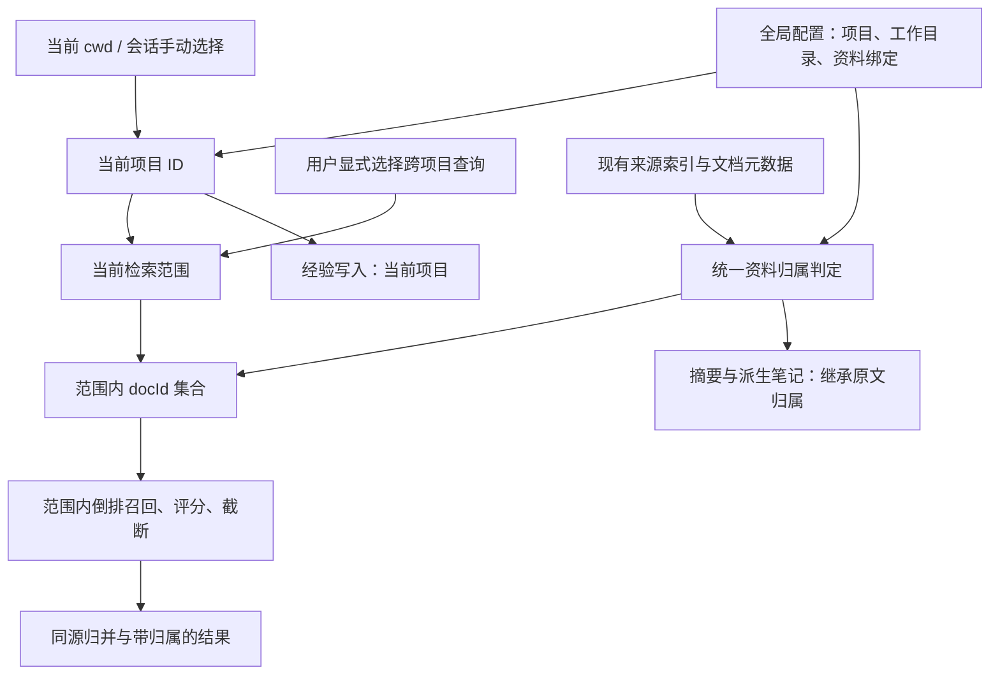

# pi-kb 项目隔离架构与实施方案

状态：待审阅。仅编写方案，尚未修改实现。

核心方案：**项目 ID + 工作目录识别 + 文档路径绑定 + 召回前过滤**。默认检索当前项目与明确共享的资料，经验默认记到当前项目；保留显式跨项目查询。

## 一、背景与目标（Context）

- 同一用户维护十几个项目，全库混搜容易让同名组件、不同版本 API 和项目专属经验互相干扰。
- 已讨论方向：稳定项目 ID 分别绑定代码目录、文档目录；默认只检索当前项目及其明确关联的共享资料。
- 文档不必放在代码仓库中；一个项目可以关联多个仓库和多个资料目录。
- 本次是检索范围和笔记归属隔离，不是操作系统文件权限隔离。

## 二、推荐架构（Approach）



### 2.1 数据模型：项目、物理来源、资料绑定分开

继续使用用户级 `pi-kb.json`，不在每个代码仓库放一份知识库配置。新增字段如下，均为本方案设计，尚未实现：

| 对象 | 字段与职责 |
| --- | --- |
| 项目 `projects[]` | 稳定 `id`、显示名称 `name`、工作目录列表 `workspaces`。一个业务项目可以有多个仓库和 worktree |
| 来源 `roots[]` | 复用现有 `name / path / writable / exclude`，负责原文位置、索引位置和唯一记录目录 |
| 绑定 `bindings[]` | `root` 引用来源名称，`path` 是来源内的相对目录或精确文件路径，`scope` 声明归属 |
| 归属 `scope` | `{ "projects": ["项目ID", ...] }`、`"shared"`、`"unassigned"` 三选一 |
| 会话状态 | 当前项目选择、临时额外检索的项目。只存当前会话，不写入全局“当前项目” |

`projects` 数组非空表示只供列出的项目使用；`shared` 表示所有项目和未识别项目的会话都可见；`unassigned` 表示未分类，不参与正常查询。A、B 共用的平台文档直接绑定两个项目，无须设置全局共享。

以下为 Windows 配置示例，路径仅用于说明：

```json
{
  "version": 2,
  "projects": [
    { "id": "project-a", "name": "项目 A", "workspaces": ["D:/Code/a-web", "D:/Code/a-api"] },
    { "id": "project-b", "name": "项目 B", "workspaces": ["D:/Code/b"] }
  ],
  "roots": [
    { "name": "个人笔记", "path": "D:/Notes/Obsidian" },
    { "name": "平台文档", "path": "D:/Docs/platform" },
    { "name": "AI记录", "path": "D:/Notes/Obsidian/agent", "writable": true }
  ],
  "bindings": [
    { "root": "个人笔记", "path": "项目A", "scope": { "projects": ["project-a"] } },
    { "root": "个人笔记", "path": "项目B", "scope": { "projects": ["project-b"] } },
    { "root": "个人笔记", "path": "通用技术", "scope": "shared" },
    { "root": "平台文档", "path": ".", "scope": { "projects": ["project-a", "project-b"] } }
  ]
}
```

实际配置保留原来的 `enrich`；项目绑定不包含模型凭证。普通文档优先按目录绑定；零散文档和旧经验需要例外时，精确文件路径复用同一绑定表，不另建标签系统。

### 2.2 当前项目如何确定

1. 用户通过 `/kb` 明确选择的项目优先，支持恢复“按工作目录自动识别”。
2. 自动模式用规范化真实 `cwd` 匹配 `workspaces`，按路径段判断包含关系，采用最具体的匹配；不是目录名匹配，也不是字符串前缀匹配。
3. 同一个真实工作目录不能同时绑定两个项目。新增 worktree 可以手动绑定同一项目，不通过 Git remote 猜项目身份。
4. 没有匹配时进入“未识别项目”：只查 `shared`，不自动选择最近使用的项目。写项目经验返回明确提示，先选择项目。
5. 项目 ID 不随显示名称或代码目录变化；目录搬家修改路径即可。文档来源搬迁后的索引和摘要仍须按原有来源路径、哈希规则验证，不承诺缓存自动搬迁。

`/kb` 和独立底栏状态显示当前项目及跨项目查询范围。手动选择用 Pi 0.85.1 已提供的 `pi.appendEntry()` 保存，读取当前分支 `getBranch()` 恢复；恢复、分叉、`/reload` 时重新校验项目是否存在。会话树切换也要恢复对应分支状态，不能沿用另一分支的选择。切换当前项目时重置临时跨项目范围；选择失效时显示未识别状态，不自动扩大范围。

两个窗口分别在 A、B 项目工作时互不影响。切换项目只影响后续检索、提示和写入，不清除已进入对话的旧内容；需要独立上下文时新建会话。

### 2.3 文档归属与目录重叠规则

统一归属函数接收**完整配置**，先解析归属，再判断可见性。不能先只留下 A 的绑定，否则 B 的专属子目录可能重新落入共享父目录。

| 情况 | 处理 |
| --- | --- |
| 无绑定 | `unassigned`，不默认共享 |
| 父目录共享，子目录属于 A | 子目录只按 A 处理，B 不能从父目录绕过 |
| 父目录属于 A，子目录明确共享 | 更具体的共享绑定生效，这是用户的显式选择 |
| 文件有精确绑定 | 精确绑定覆盖目录绑定 |
| 不同 root 覆盖同一文件 | 按规范化真实路径统一比较绑定具体程度，不能把多个 root 的权限简单取并集 |
| 同一真实路径出现冲突绑定 | 配置校验拒绝，并定位冲突；不按配置先后顺序决定 |
| 任一覆盖 root 排除了该文件 | 保留现有排除优先规则，绑定不能重新放行 |

校验引用的 root / 项目是否存在，拒绝绝对的绑定相对路径、`..` 越界和归属格式错误。保留 Windows 路径大小写、斜杠和真实路径处理；来源内部符号链接、目录联接沿用现有跳过策略。

删除项目时，其专属绑定变为显式 `unassigned`，不能简单删除后继承共享父目录。多项目绑定只移除该 ID；列表变空则未分类。仅在元数据里引用已删除项目的 lesson 也视为未分类。

删除来源前检查重叠路径：若其他 root 仍覆盖这些文件，将原绑定迁到仍覆盖它的 root，保留原归属；无法保持边界时拒绝该删除操作并提示先处理绑定。没有其他 root 覆盖时才移除绑定。源文档不删除，失去有效来源的摘要与派生笔记不能单独放行。用户主动解绑目录时也展示生效后的范围，支持改为 `unassigned` 来阻断父级共享。

### 2.4 检索：先限范围，再召回和评分

默认范围为“当前项目 + 全局共享”。临时跨项目查询由用户在 `/kb` 中选额外项目，允许显式选择全部已分类项目；它不改变当前项目或经验写入目标。未分类资料始终只在管理界面中处理。

`kb_search` 保持 `query / root? / limit?` 接口；范围由扩展根据会话注入，模型不能通过省略参数或传其他 root 自动扩大范围。`root` 仅与当前范围取交集。零命中明确返回未找到，不回退全库；提示策略只列当前有效来源与检索范围。

索引查询流程：

1. 选择可能含有可见文档的物理来源；集中记录目录也参与，但其中每条 AI 笔记单独判定。
2. 固定本次读取的索引世代，读取该世代的文档元数据，计算可见 `docId` 集合。
3. 倒排项先与集合取交集，再计算命中、评分、候选截断。`N` 和 `df` 使用当前来源范围内的文档数与词频，其他项目不参与这两个统计。
4. 复用现有候选正文校验、哈希检查和同源归并；返回条目增加归属标识，结果整体带实际查询范围。
5. 发布结果前复查范围配置是否变化；若变化则按新范围重算，不能发布切换前缓存的结果。

当前 `searchRootIndex` 在读取元数据前截取 `max(limit * 4, 20)` 个候选，必须调整；仅在最终 `hits` 上过滤无法满足隔离目标。默认多词、部分匹配和同源排序策略不另行重构。

所有旁路遵守同一规则：`semanticHits` 按记录的原文路径过滤；`hitsFromPrepared`、`searchLayer` 在匹配与截断前过滤，能跳过的无关目录提前跳过；`hitsFromIndexedRoot` 在读取正文和返回结果前复核归属及排除规则。格式损坏、缺失来源或未知归属的 AI 笔记不能当作普通文档放行。

### 2.5 存储、后台索引与性能

- 原文及派生笔记继续放在现有位置，每个 root 维护一套 `.pi-kb/`；项目共享文档不复制正文或索引。
- 目录归属在查询时由绑定计算。仅修改绑定立即失效范围缓存，不要求重建词项索引，更不调用清洗模型。
- 来源采集继续覆盖该来源原有范围，不能根据某个会话项目重建共享索引，否则 A 的后台任务可能删除 B 的索引文档。
- 可见文档集合只缓存在内存，以来源、世代、完整范围配置指纹和会话选择为键。每个来源仅保留当前需要的缓存，世代或配置变化丢弃；首次计算读文档元数据，不读整库正文。
- 为 `getDocs / getPostings` 增加按指定世代读取的能力，复用文档分片遍历取得元数据；避免一次查询混用后台发布前后的世代。世代被回收时重试最新世代，失败报索引错误，不退回无范围检索。
- 索引文档新增可选的 lesson 归属字段；旧索引缺失字段时保守视为未分类，并允许刷新记录目录补齐。无需增加第二套永久项目索引。

### 2.6 AI 笔记和完整阅读凭证

| 类型 | 归属依据 | 写入行为 |
| --- | --- | --- |
| 原文 | 最具体路径绑定 | 不修改原文 |
| 批量派生笔记 `derived` | `sourcePath` 对应原文的当前归属 | 继续写 `.pi-kb/notes/`，不固化整理会话的项目 |
| 资料整理 `digest` | `sourcePath` 对应原文的当前归属 | 保留路径哈希与内容哈希去重，多个项目复用同一份 |
| 问题经验 `lesson` | 新笔记的 `scope` 元数据；旧笔记由用户精确文件绑定 | 仍写唯一记录目录的 `lessons/`，默认 `scope.projects` 只有当前项目 ID |

归属字段必须由插件写入，不能由模型在正文里声明。`cwd` 继续保留为创建记录，不参与归属推断。普通目录绑定对生成的 `digests/`、`lessons/`、`.pi-kb/` 不作自动授权：digest / derived 追溯原文；lesson 使用自身元数据或明确的文件级人工归类。合法精确 lesson 绑定优先于旧元数据，便于修正归属且不改笔记文件。

`kb_write` 不新增任意项目参数。跨项目查询时，lesson 仍写当前项目；没有当前项目则不写。确需将经验共享，由用户在 `/kb` 中明确调整该笔记的归属。digest 则继承已允许读取的原文归属，不转成当前项目专属。

内置 `read` 的原有功能不拦截，但范围外原文不签发 `readRef`。签发时和写摘要前都重新校验来源范围与内容哈希；项目、绑定或查询范围变更时清空 `pending / refs / prompted`，防止使用旧范围的阅读凭证。异步 `tool_result` 也需确认开始阅读时的范围版本仍有效。派生笔记仍不签发凭证，记录目录原文现有凭证限制保持不变。

### 2.7 `/kb` 设置流程与迁移

日常设置沿用现有菜单，增加“项目管理、当前项目、资料归属、跨项目查询、未分类资料”：

1. 创建项目，名称可修改，项目 ID 一次生成后固定。
2. 绑定当前工作目录；优先识别实际仓库根目录作为候选，再允许修改。非 Git 目录直接使用选定目录，不把上层工作区猜成项目。
3. 从现有 root 选择整个来源或子目录，归到当前项目；需要多个项目复用时勾选多个项目，需要所有场景可见时选全局共享。
4. 文档不在已配置来源内时沿用“添加目录”，再设置归属；只有新增来源才走既有导入、可选 AI 清洗流程。
5. 设置完成显示生效范围和经验记录目标。项目状态使用独立状态栏键，不覆盖 AI 整理进度。

无 UI 时提供最少的命令式入口：`/kb project <id|auto|shared>` 选择当前项目、自动识别或仅共享；`/kb scope <current|all|项目ID列表>` 调整临时检索范围。ID 保留字须校验；非法或已删除的项目明确报错，不能回退全库。现有 refresh / enrich / pause 保留。

迁移规则：

- **旧配置没有 version 字段**：仍可加载，明确显示“未启用项目隔离”，继续原来的全库行为；升级扩展不擅自分类资料。不认识的版本号和损坏的 v2 配置直接报错，不能降级回全库。
- **用户启用隔离**：在 `/kb` 预览目录绑定和未分类资料后，备份并原子写入 v2 配置。已有 root 可批量归类；未绑定内容进入未分类，绝不自动变成共享。
- **旧 digest / derived**：根据现有 `sourcePath` 自动继承绑定，不改文件、不重新调用模型；来源无法核实时继续排除。
- **旧 lesson**：不根据 cwd 自动确定项目；菜单列出标题与原始创建位置供判断，用户明确选择后写精确文件绑定，可批量操作；原笔记不移动、不改正文或元数据。
- **配置保存**：添加/删除来源、设置记录目录、选择清洗模型时保留全部新字段；绑定引用与项目删除联动校验。
- **恢复旧配置**：使用启用前备份即可恢复旧行为；不删除现有来源、笔记或索引。

### 2.8 本轮范围

实现目录优先绑定、必要的单文件例外、所有检索通道过滤、笔记归属、配置迁移与会话选择。复用现有扫描、清洗、发布、读证据和索引结构。

不引入向量、SQLite、付费分类、LLM 重排、每轮自动 RAG、按 Git 分支细分项目或多用户权限系统。不自动移动用户文档，也不把原文的“创建时项目”当成唯一适用范围。

## 三、已核实的实现与复用（Reuse）

| 现有实现 | 位置 | 复用方向 |
| --- | --- | --- |
| 来源配置、真实路径与排除规则 | `lib/kb.ts` 的 `RootInput`、`LoadedRoot`、`loadConfigFile` | 保留来源与物理目录管理 |
| 倒排召回与候选截断 | `lib/retrieval.mjs` 的 `searchRootIndex` | 在评分和候选截断之前增加范围限制 |
| 索引世代和文档分片 | `lib/index-store.mjs` 的 `readGeneration`、`getDocs`、`getPostings`、`listDocIds` | 固定世代，复用分片读取，提供文档元数据遍历 |
| 路径与重叠 | `lib/source.mjs` 的 `pathKey / pathInside / samePath`；`lib/kb.ts` 的 `mostSpecificRoot / coveredAndExcluded` | 复用跨平台比较和排除，新增绑定优先级 |
| 统一检索入口 | `lib/kb.ts` 的 `searchKb` | 统一传入会话范围 |
| digest / lesson 发布 | `lib/kb.ts` 的 `writeDigest`、`writeLesson` | 保留安全写入，补充归属 |
| 语义补充与无索引回退 | `lib/kb.ts` 的 `semanticHits`、`hitsFromPrepared`、`searchLayer` | 复用检索逻辑，统一套用范围判定 |
| 增量采集 AI 笔记 | `lib/collect.mjs` 的 `indexRoot`、`peekNoteKind` | 将新 lesson 项目 ID 带入文档元数据 |
| 派生笔记来源追溯 | `lib/semantic.ts` 的 `publishDerivedNotes` | 已有 `sourcePath`，保持原有整理与发布流程 |
| 阅读凭证与现成提示 | `extensions/index.ts` 的 `tool_call`、`tool_result`、`lookupRef` | 在签发和使用时核对当前范围 |

## 四、预计修改文件（Files to modify）

| 文件 | 最小必要改动 |
| --- | --- |
| `lib/scope.mjs`（新增） | 项目匹配、路径绑定优先级、文档可见性纯函数，供 TS 与原生 `.mjs` 共同调用，不引入服务/策略类 |
| `lib/kb.ts` | 扩展配置读写、作用域类型、菜单与迁移、全部检索路径过滤、lesson 元数据与结果归属 |
| `extensions/index.ts` | 会话项目恢复/切换、传入范围、状态与提示策略、命令分发、readRef 生命周期校验 |
| `lib/retrieval.mjs` | 可见集合过滤，范围内 N / df，评分和截断顺序 |
| `lib/index-store.mjs` | 读取指定世代和遍历文档元数据，沿用原子发布与锁 |
| `lib/collect.mjs` | `peekNoteKind` / `indexRoot` 提取 lesson 归属，坏元数据不能降级成为无归属通用笔记 |
| `tests/scope.test.ts`（新增） | 覆盖项目识别、路径绑定和归属判断 |
| 现有 `tests/kb.test.ts`、`tests/index.test.ts`、`tests/collect.test.ts`、`tests/semantic.test.ts`、`tests/plugin.test.ts` | 在现有测试中补充查询、配置、语义旁路、写入和生命周期用例 |
| `scripts/bench-kb.mjs`、`README.md` | 多项目混合语料基准与中文配置、迁移说明 |

`lib/semantic.ts` 已在派生记录和索引中保存 `sourcePath`，优先直接复用；不为项目归属重写模型提示或整理账本。`lib/kb-worker.mjs` 保持按来源索引；`package.json` 的 `lib/**/*.mjs` 已覆盖新增模块，无须新增依赖。

## 五、实施步骤（Steps）

- [x] **1. 配置与统一归属。** 扩展 v2 schema 和完整配置保存；新增纯函数解析项目、绑定和可见性，完成路径/冲突/排除测试。此时尚不启用用户现有配置的隔离。
- [x] **2. 索引查询范围。** 固定世代、元数据可见集合、范围内评分和截断；以大量跨项目同名文档验证不抢候选，保留旧检索模式。
- [x] **3. 联合检索全部入口。** 将同一作用域接到索引、原文回退、语义记录、digest / lesson / derived、root 筛选及结果格式，排除未知与失效来源。
- [x] **4. 写入与阅读凭证。** 新 lesson 自动记当前项目；摘要沿用来源归属与去重；签发、使用和异步完成时均检查范围版本，切换清空凭证。
- [x] **5. 会话与用户配置。** `/kb` 设置项目、工作目录、资料绑定、临时跨项目检索；恢复当前分支选择，更新状态和模型提示；完成旧配置备份和未分类资料的人工归属流程。
- [x] **6. 验证与文档。** 运行对应自动化检查及真实 Pi 会话，记录多项目命中、跨项目污染和性能数据，补充 README 与未验证平台说明。

## 六、验证方案（Verification）

### 自动化检查

沿用 Node 自带测试运行器，执行 `npm test`。测试数据使用临时目录，不向真实知识库写测试经验。

| 场景 | 预期 |
| --- | --- |
| A、B 含同名但相反规则；多仓库绑定 A | A 的各仓库只召回 A 及共享，B 同理 |
| 同一来源有 200 篇高分 B 文档与 1 篇正确 A 文档，limit 为 1 | A 文档仍能被选出；B 不影响范围内 N / df |
| 父级共享、子级 A、另有重叠 root | B 不能从父级或另一个 root 召回 A 的内容 |
| 目录共享、精确文件归属 B；子级未分类 | 最具体规则生效，未分类不继承共享 |
| 正常索引、缺失索引回退、语义单独命中 | 三条通路的范围一致，空结果不自动全库搜索 |
| 原文位于 A，digest 位于集中记录目录 | 只对允许 A 的查询可见；共享原文的 digest 可复用 |
| 合法旧 lesson 无 scope、只记录 cwd | 不进入默认结果；精确绑定后可见且文件字节不变 |
| AI 笔记格式损坏或摘要来源无法验证 | 跳过并说明原因，不能降级成原文绕过过滤 |
| 自动/手动选择、恢复、分叉、会话树切换、两个窗口 | 恢复正确选择，两个项目窗口互不影响 |
| 跨项目读完 B 原文后取消扩展范围 | 原有凭证失效，不可在 A 当前范围写 B 摘要 |
| 异步 read 未结束时改范围、后台索引同时发布 | 不签发旧范围凭证，查询不混用世代 |
| 修改 binding、exclude、项目名称、删除项目/来源 | 后续查询即时遵守新配置，缓存与凭证失效；删除专属项目不变共享 |
| 改清洗模型或记录目录，旧配置迁移与备份恢复 | 项目字段保留，旧模式和隔离模式的状态明确 |
| 仅绑定现有资料与切换项目 | 原文哈希不变，清洗模型调用数为 0 |

有 Pi 运行时的环境实际执行扩展事件测试；本地依赖缺失导致测试跳过时单独报告，并用真实 Pi 加载验证补足，不把跳过项计作已验证。

### 真实会话与性能验证

- 在临时资料中构造约 12 个项目、共享资料及集中记录目录，注入相同 API 名称和互相冲突的参数规则；在 A、B 工作目录分别提问，不在问题里提示使用知识库，检查是否主动 `kb_search`、命中文档与最终回答是否符合当前项目。
- 在未绑定目录验证只搜索全局共享；用户显式跨项目查询后结果有项目标识，结束后恢复默认范围，lesson 写入目标始终可解释。
- 在实际 Obsidian / showdoc 上演示绑定预览、默认范围和跨项目查询；具体真实目录归属须由用户设置，不能测试时擅自把业务资料分给虚构项目。
- 沿用 `scripts/bench-kb.mjs` 报告首次范围元数据加载、重复查询、绑定变更后首次查询的耗时和内存，比较开启/关闭隔离的数据；不预先承诺性能数字。
- Linux 本机、已支持的 Node/Pi 版本做实跑；Windows 中文目录、大小写、目录联接、安装版 Pi 若无法实机验证，明确记录未验证，不以模拟路径测试代替。

通过标准以“范围外资料不进入默认召回、范围内正确资料不被外项目截断、派生资料和经验归属一致、切换与迁移可解释”为核心；主动调用率和语义回答准确率分别记录，不用隔离测试通过宣称模型每次都会查库。
